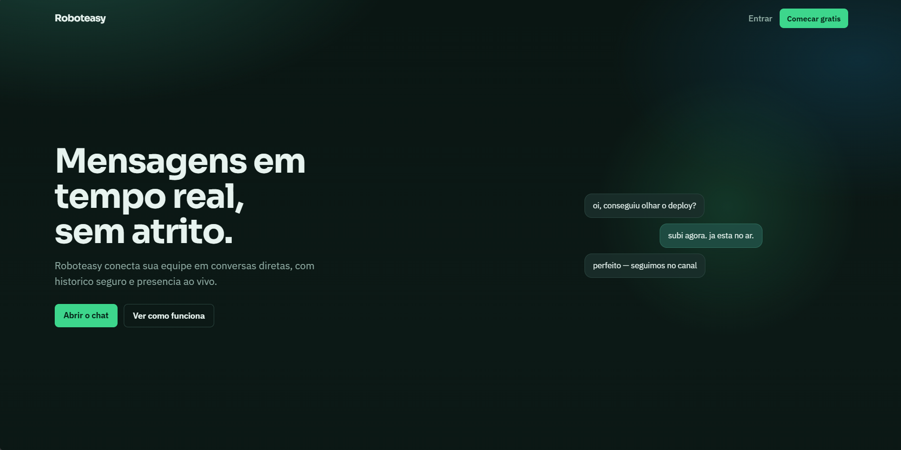
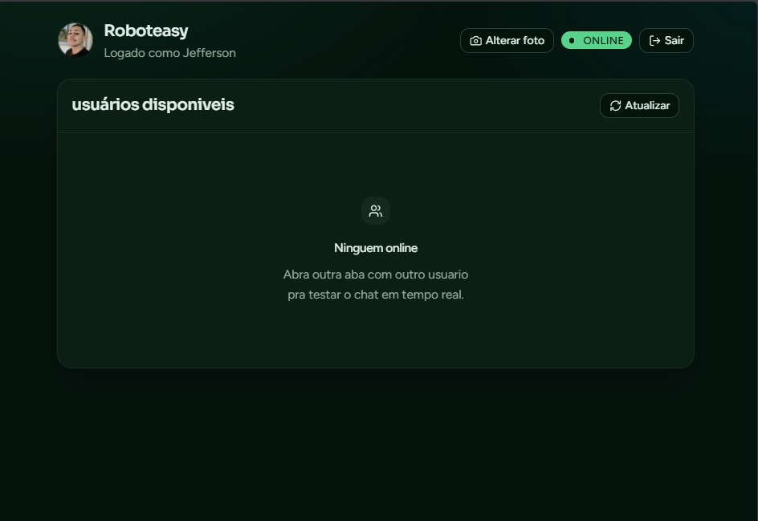
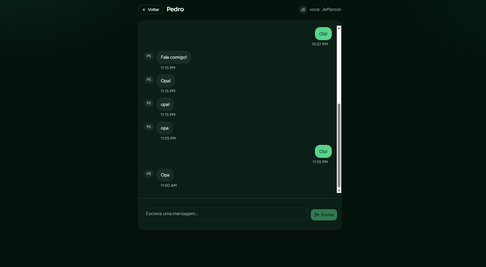
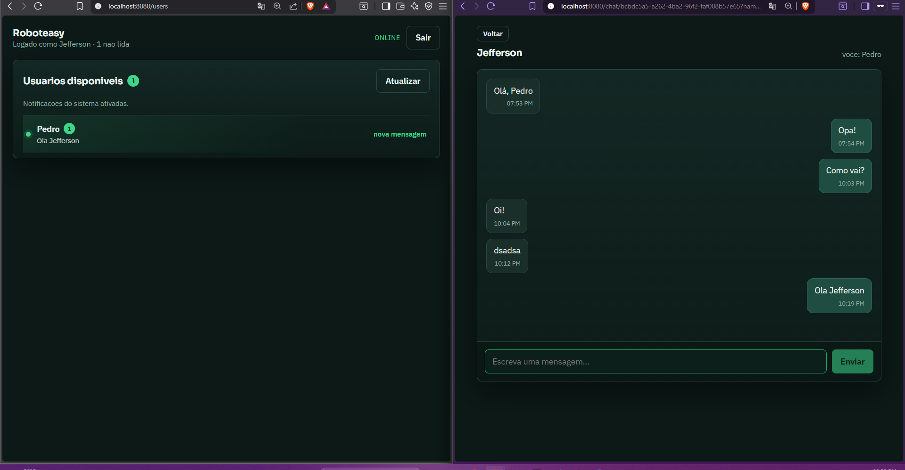

# Roboteasy

Chat em tempo real — solucao do desafio full stack.

Auth JWT, usuarios online, mensagens via SignalR e historico no Mongo. Dois servicos .NET (Auth + Chat), frontend Vue 3 + TypeScript, tudo sobe com Docker.

**Documentacao completa:** [docs/README.md](docs/README.md) (screenshots, arquitetura, como rodar)

**Visao de evolucao com IA:** [docs/07-evolucao-ia.md](docs/07-evolucao-ia.md) (doc only, fora do escopo do codigo)

**Enunciado original:** [docs/DESAFIO.md](docs/DESAFIO.md)

## Preview

| Landing | Usuarios online | Conversa | Nao lidas |
|---------|-----------------|----------|-----------|
|  |  |  |  |

## Rodar em 1 comando

```bash
docker compose up --build
```

http://localhost:8080

## Entregue

- Login/cadastro com JWT (Postgres)
- Lista de quem esta conectado agora
- Chat 1:1 com historico (Mongo + SignalR)
- Indicador de mensagens nao lidas (badge + preview na lista)
- Chat escalavel: Redis (backplane + presenca TTL) + **2 replicas** (`chat-a`/`chat-b`) + sticky nginx
- Docker Compose + nginx

## Stack

Vue 3 · Tailwind · shadcn-vue · .NET 10 · PostgreSQL · MongoDB · RabbitMQ · Redis · SignalR

## Testes

```bash
dotnet test tests/Auth.Api.Tests
dotnet test tests/Chat.Api.Tests
```

Ver [docs/testes.md](docs/testes.md) (Auth in-memory; Chat com `MONGO_TEST_URL` opcional).

## CI

GitHub Actions: [`.github/workflows/ci.yml`](.github/workflows/ci.yml) — build Auth/Chat, testes Auth + Chat (Mongo) e `npm run build`.

Local (equivalente):

```bash
dotnet build services/auth/Auth.Api.csproj
dotnet build services/chat/Chat.Api.csproj
dotnet test tests/Auth.Api.Tests
dotnet test tests/Chat.Api.Tests
cd frontend && npm ci && npm run build
```

## Deploy (Terraform)

Infra declarada em [`infra/`](infra/README.md):

- [Google Cloud](infra/gcp/) — Compute Engine + Docker Compose
- [AWS](infra/aws/) — EC2 + VPC + Elastic IP + Docker Compose

## Escala horizontal — ponto critico que identifiquei

Auth e Frontend sao **stateless**: sobem N replicas sem drama (ECS / Cloud Run).

O gargalo e o **Chat + SignalR**. Sem store compartilhado, presenca e conexoes WebSocket ficariam **so na memoria do processo**. Com 2+ instancias isso quebraria:

1. Usuario A no pod 1, B no pod 2
2. `Clients.User(...)` no pod 1 nao veria B
3. Online/offline inconsistente

**Isso ja esta resolvido no compose atual** (nao e so plano):

| Medida | No codigo / compose |
|--------|---------------------|
| **Redis backplane** (SignalR) | `AddStackExchangeRedis` |
| **Presenca Redis + TTL 60s** | `RedisPresenceTracker` + heartbeat 20s (pod morto some sozinho) |
| **2 replicas Chat** | `chat-a` + `chat-b` |
| **Sticky** | nginx `ip_hash` (local); exemplos ALB / Cloud LB em `infra/` |
| **RabbitMQ** | publish/consume entre qualquer replica |

Resumo no compose: [docs/06-docker.md](docs/06-docker.md).
