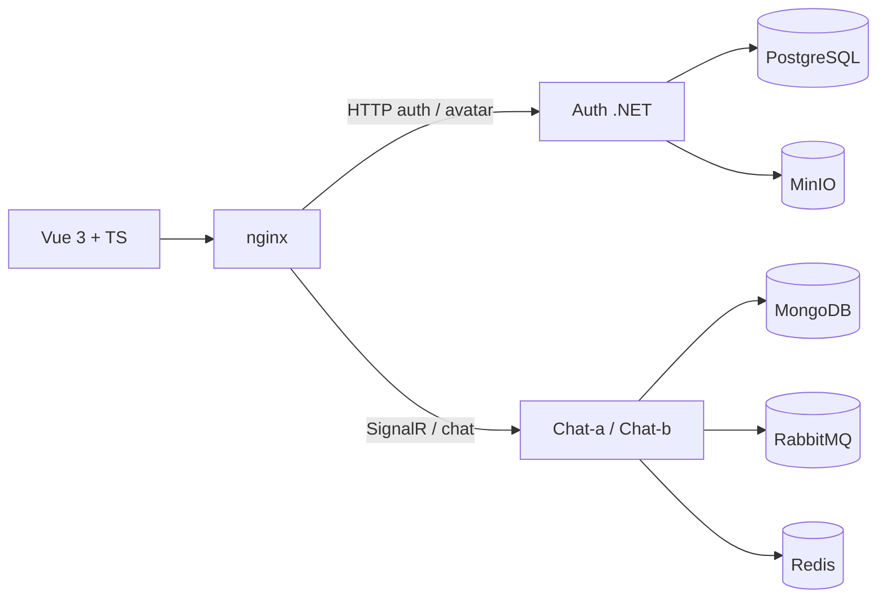

# Roboteasy

Chat em tempo real para conversas diretas — solucao do desafio full stack Roboteasy.

Auth com JWT, presenca ao vivo, mensagens via SignalR e historico persistido. Frontend em Vue 3 + TypeScript; backend em dois servicos .NET (Auth e Chat).

## Preview

### Landing

Pagina inicial posicionando o produto antes do login.


### Usuarios online

Lista quem esta conectado agora; clique inicia a conversa.


### Conversa

Historico carregado do Mongo + envio em tempo real.


### Mensagens nao lidas

Com o site aberto na lista (sem chat aberto), novas mensagens aparecem com badge, preview e destaque no usuario.

## O que foi entregue

| Requisito | Como foi feito |
|-----------|----------------|
| Login / cadastro + JWT | `services/auth` — Postgres, BCrypt, Bearer token |
| Avatar de perfil | Upload via Auth → MinIO (S3 SDK); proxy `GET /api/users/avatar/{key}` |
| Usuarios online | SignalR + **Redis** (`RedisPresenceTracker`, TTL 60s); 2 replicas `chat-a`/`chat-b` |
| Mensagens realtime | Hub `/hubs/chat`, RabbitMQ + **Redis backplane** SignalR |
| Historico | MongoDB, filtro por par de usuarios |
| Frontend Vue (3 telas) | Login (+ passo opcional de avatar), lista online, conversa (+ landing) |
| Mensagens nao lidas | Badge + preview na lista; titulo `(N) Roboteasy`; Notification API opcional |
| Escala do Chat | nginx `ip_hash` (sticky) + Redis; ver secao de escala no [README raiz](../README.md#escala-horizontal--ponto-critico-que-identifiquei) |
| Docker | `docker compose up --build` sobe tudo (inclui redis, minio + 2 chats) |

## Stack

| Camada | Tecnologia |
|--------|------------|
| Frontend | Vue 3, TypeScript, Pinia, Vue Router, SignalR, Tailwind + shadcn-vue |
| Auth | .NET 10, EF Core, PostgreSQL, AWSSDK.S3 (MinIO / S3) |
| Chat | .NET 10, SignalR, MongoDB, RabbitMQ, Redis (presenca + backplane) |
| Infra | Docker Compose, nginx (proxy + sticky `ip_hash` para o Chat), MinIO |

## Arquitetura



nginx faz sticky (`ip_hash`) entre as duas replicas do Chat. Variantes AWS/GCP e fluxos de mensagem/avatar: [diagrams-mermaid.md](diagrams-mermaid.md).

Escala do Chat (Redis, 2 replicas, sticky): secao no [README raiz](../README.md#escala-horizontal--ponto-critico-que-identifiquei).

Documentacao do processo:

- [Entendimento](01-entendimento.md)
- [Auth](03-auth.md) · [Chat](04-chat.md) · [Frontend](05-frontend.md) · [Testes](testes.md)
- [Deploy Terraform](../infra/README.md) — GCP (Compute Engine) e AWS (EC2)

## Como rodar

Requisitos: **Docker** + **Docker Compose**.

```bash
docker compose up --build
```

Abrir **http://localhost:8080**

### Teste rapido

1. Cadastre usuario A e entre
2. Em aba anonima, cadastre usuario B
3. Confira os dois na lista de online
4. Clique e troque mensagens

RabbitMQ management (opcional): http://localhost:15672 — `guest` / `guest`

### Desenvolvimento local

Infra only:

```bash
docker compose up postgres mongo rabbitmq redis minio -d
```

APIs:

```bash
dotnet run --project services/auth --urls http://localhost:5001
dotnet run --project services/chat --urls http://localhost:5002
```

Frontend:

```bash
cd frontend && npm install && npm run dev
```

Vite em http://localhost:5173 (proxy para as APIs).

## CI

Workflow: [`.github/workflows/ci.yml`](../.github/workflows/ci.yml) — build .NET, testes Auth + Chat (Mongo no job) e build do frontend.

Comandos locais equivalentes: ver [README raiz](../README.md#ci).

## Enunciado original

O texto completo do desafio esta em [DESAFIO.md](DESAFIO.md).
