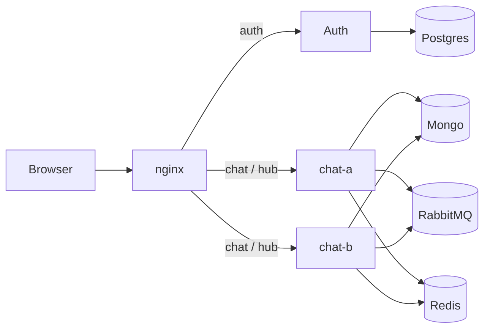
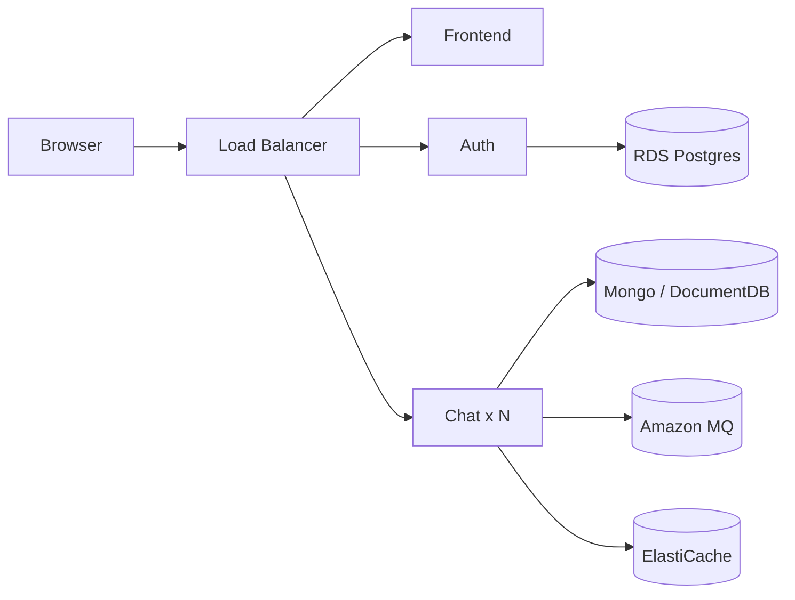
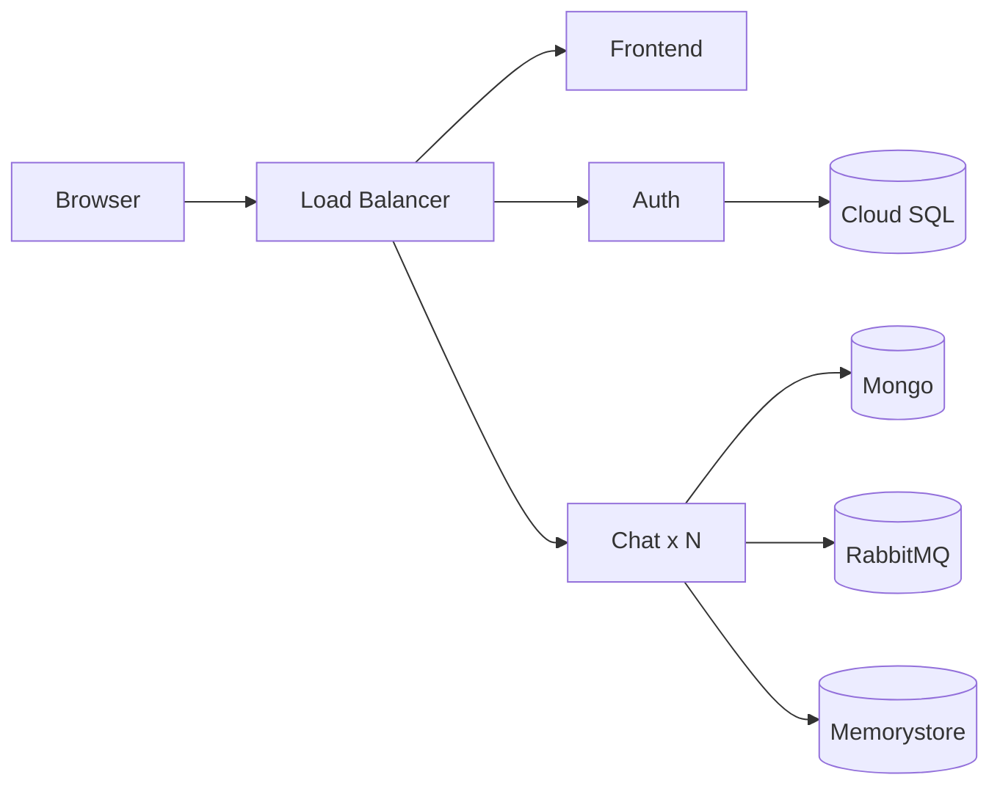
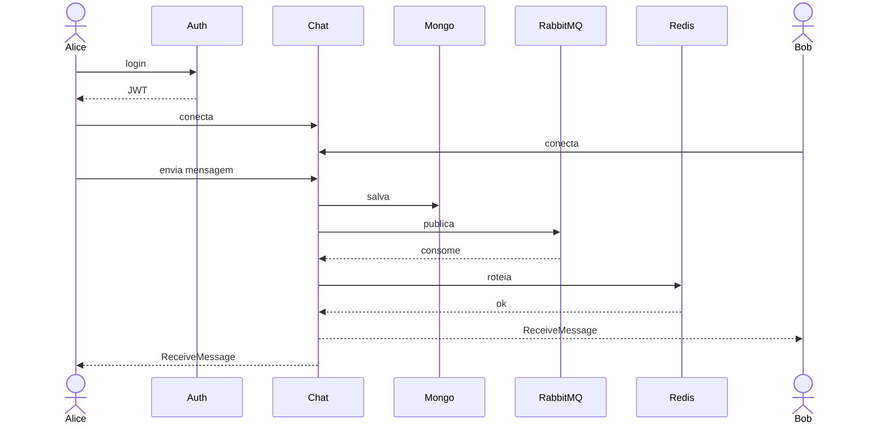

# Diagramas Mermaid (Excalidraw)

Cole um bloco por vez: **Insert → Mermaid**.

---

## 1 — Local

```mermaid
flowchart LR
  Browser[Browser] --> Nginx[nginx]

  Nginx -->|auth| Auth[Auth]
  Nginx -->|chat / hub| ChatA[chat-a]
  Nginx -->|chat / hub| ChatB[chat-b]

  Auth --> Postgres[(Postgres)]
  ChatA --> Mongo[(Mongo)]
  ChatB --> Mongo
  ChatA --> Rabbit[(RabbitMQ)]
  ChatB --> Rabbit
  ChatA --> Redis[(Redis)]
  ChatB --> Redis
```

---

## 2 — AWS

```mermaid
flowchart LR
  Browser[Browser] --> ALB[Load Balancer]

  ALB --> Frontend[Frontend]
  ALB --> Auth[Auth]
  ALB --> Chat[Chat x N]

  Auth --> RDS[(RDS Postgres)]
  Chat --> Mongo[(Mongo / DocumentDB)]
  Chat --> MQ[(Amazon MQ)]
  Chat --> Cache[(ElastiCache)]
```

---

## 3 — GCP

```mermaid
flowchart LR
  Browser[Browser] --> LB[Load Balancer]

  LB --> Frontend[Frontend]
  LB --> Auth[Auth]
  LB --> Chat[Chat x N]

  Auth --> SQL[(Cloud SQL)]
  Chat --> Mongo[(Mongo)]
  Chat --> MQ[(RabbitMQ)]
  Chat --> Cache[(Memorystore)]
```

---

## 4 — Como uma mensagem chega no outro lado

```mermaid
sequenceDiagram
  actor Alice
  participant Auth
  participant Chat
  participant Mongo
  participant RabbitMQ
  participant Redis
  actor Bob

  Alice->>Auth: login
  Auth-->>Alice: JWT

  Alice->>Chat: conecta
  Bob->>Chat: conecta

  Alice->>Chat: envia mensagem
  Chat->>Mongo: salva
  Chat->>RabbitMQ: publica
  RabbitMQ-->>Chat: consome
  Chat->>Redis: roteia
  Redis-->>Chat: ok
  Chat-->>Bob: ReceiveMessage
  Chat-->>Alice: ReceiveMessage
```
