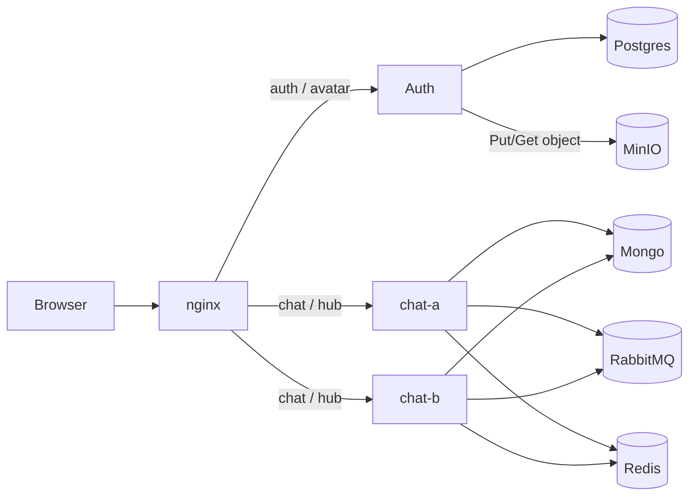
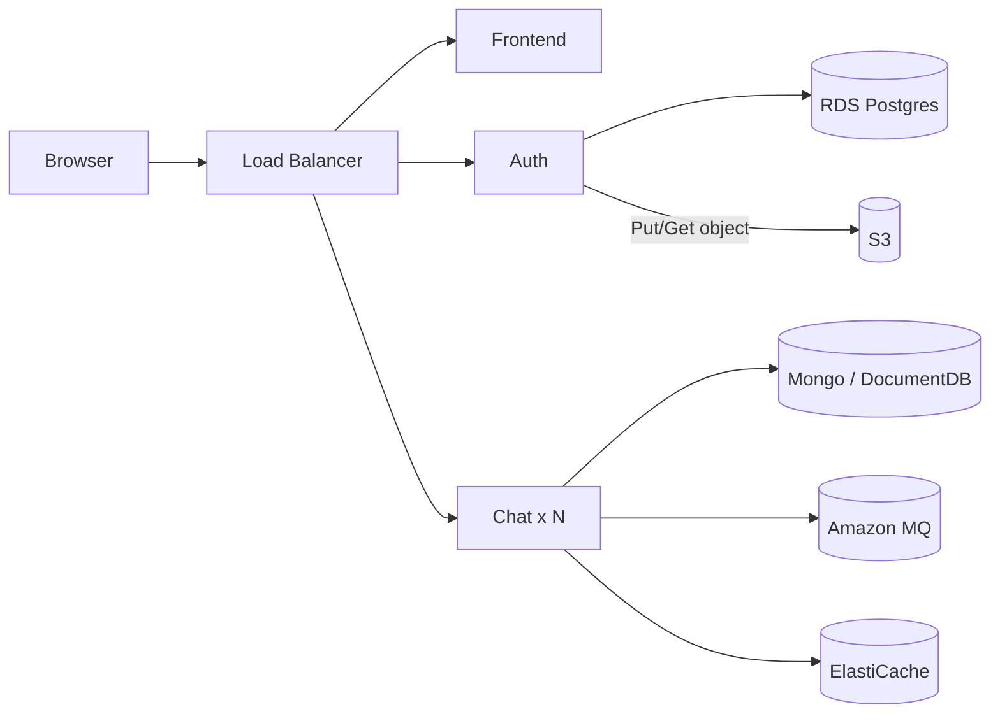
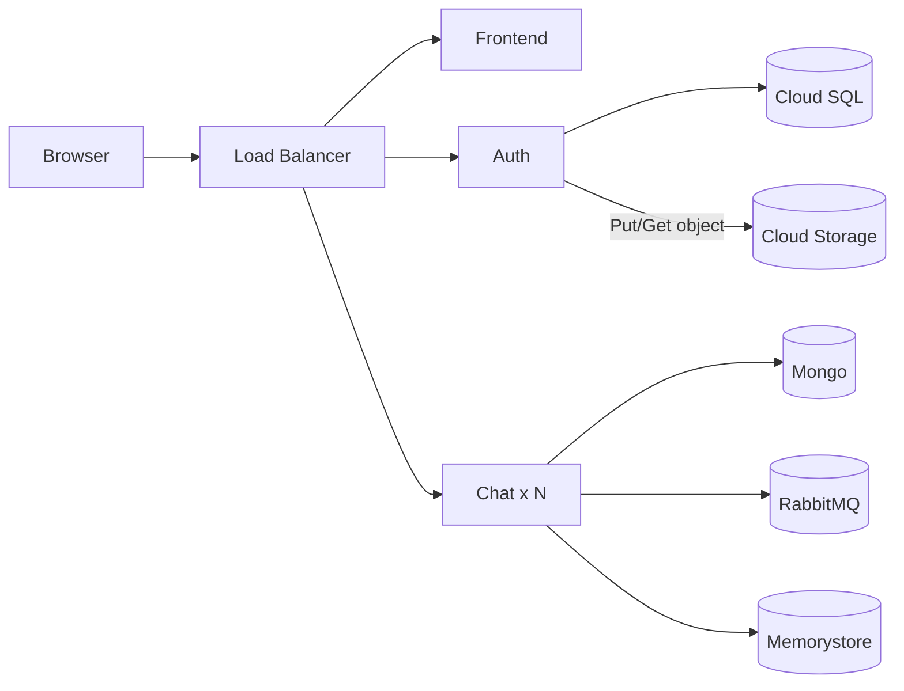
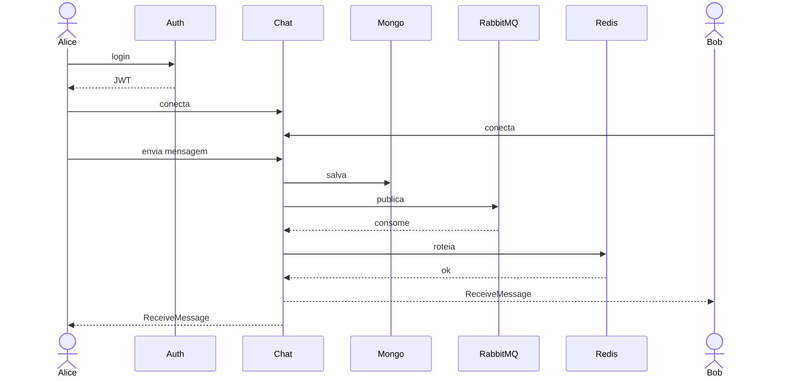
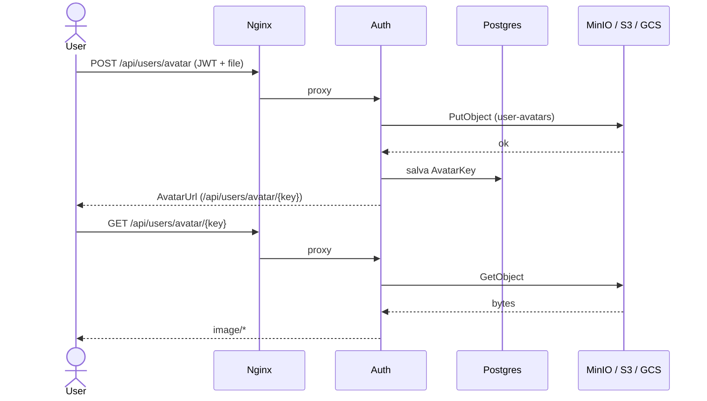

# Diagramas Mermaid

Cole um bloco por vez no [Excalidraw](https://excalidraw.com/) (**Insert → Mermaid**) ou visualize direto no GitHub/Markdown.

---

## 1 — Local

---

## 2 — AWS

---

## 3 — GCP

---

## 4 — Como uma mensagem chega no outro lado

---

## 5 — Upload de avatar

